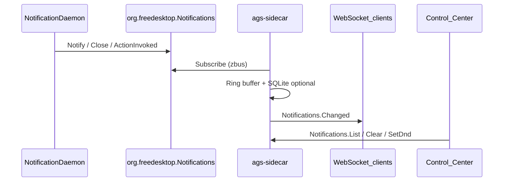

# Control Center foundation (Notifications, Keybinds, CC aggregates)

**Status:** Implemented (2026-05-28)  
**Depends on:** P0 services (Storage, Network, Power, Bluetooth, Audio, Packages), contract + notify bus  
**Aligns with:** [BACKEND_TODO.md](../BACKEND_TODO.md) §7 steps 5–6, [ARCHITECTURE_DECISIONS.md](../ARCHITECTURE_DECISIONS.md) §1 (notifications), §6 (keybinds)

---

## Goal

Ship the **next daily-use backend vertical slices** so Control Center panes stop being “best effort” stubs:

1. **Real notification feed** (Freedesktop D-Bus → sidecar history → WebSocket → UI).
2. **Hyprland keybind introspection** (read/validate; safe writes behind backups — not a full visual editor).
3. **Hardened aggregates** already called from `ui/src/lib/api.ts`: `Logs.Get`, `Security.GetStatus`, `Performance.GetMetrics`.

Hyprland file policy: Aura-owned fragments live under **`hypr/`** (see `hypr/README.md`). Keybind RPC writes only to `~/.config/ags/hypr/hyprland/aura-keybinds.conf` — never mutate the user's main Hyprland config.

---

## Out of scope

| Item | Reason |
|------|--------|
| Communication hub / Matrix bridges | Separate app (ADR) |
| Calendar CalDAV/Google sync | [calendar_sync_todos.md](calendar_sync_todos.md) |
| VPN state machine / per-app routing | [vpn_service.md](vpn_service.md) |
| Vicinae / Capture / Settings services | [launcher_vicinae.md](launcher_vicinae.md), [shell_platform.md](shell_platform.md) |
| Keybinds **live editor** in React | UI stays reference + optional `Keybinds.List` read-only first |
| Wiring DND schedule to OS daemon in v1 | Sidecar stores Aura prefs; daemon DND is best-effort via swaync/mako if exposed |

---

## Architecture (notifications)

- **Transport:** existing `notify::emit` (`{ method, params }`).
- **Persistence:** in-memory ring (e.g. 200) + optional `storage` namespace `notifications` for DND/rules only in v1 (not full history DB unless trivial).
- **Daemon-agnostic:** listen on session D-Bus; do not hard-code swaync — document swaync autostart in `hypr/hyprland/execs-aura.conf`.

---

## Vertical slices

### Slice A — `notifications.rs` (new service) — **P1**

**Files:** `sidecar/src/services/notifications.rs`, `sidecar/src/lib.rs`, `sidecar/src/types.rs` (DTOs), `ui/src/lib/api.ts`, `ui/src/lib/api-types.ts`, `ui/src/pages/control-center/panes/NotificationsPane.tsx`, optional `src/lib/sidecar.ts` (GTK later).

| Task | Details |
|------|---------|
| A.1 D-Bus subscriber | `zbus` connection to `org.freedesktop.Notifications`; handle `Notify`, `NotificationClosed`, `ActionInvoked` (log + state update). Graceful no-op when no session bus (CI). |
| A.2 In-memory store | `NotificationItem { id, app_name, summary, body, icon, urgency, timestamp, actions?, expires_at? }`; cap + eviction policy. |
| A.3 RPC — read | `Notifications.List` (`limit`, `app_name?`, `since?`), `Notifications.Get` by id. |
| A.4 RPC — mutate | `Notifications.Dismiss` (id), `Notifications.ClearAll`, `Notifications.InvokeAction` (id, action_key) — forward to daemon when possible. |
| A.5 DND / rules (Aura) | `Notifications.GetDnd` / `SetDnd` persisted in SQLite (`notifications` ns); `GetRules` / `SetRules` per-app mute list (JSON). Migrate quiet-hours from **localStorage** in UI to sidecar when RPC stable (keep localStorage fallback one release). |
| A.6 Push | `Notifications.Changed` on new/close/dnd change; debounce bursts (100–300ms). |
| A.7 UI | Wire pane: inbox list, clear-all, DND toggle + schedule from sidecar; remove “phantom RPC” disclaimer when list works. |
| A.8 Tests | Unit: parse fixture notification payloads; integration: `List` empty array without bus; mock bus optional behind `#[cfg(feature = "dbus-tests")]` if needed. |

**Acceptance:** With `swaync` (or any FD daemon) running, sending `notify-send` produces a row in Control Center within one WS tick; `ClearAll` empties sidecar history (daemon banners may remain — document).

---

### Slice B — `keybinds.rs` (new service) — **P1**

**Files:** `sidecar/src/services/keybinds.rs`, `sidecar/src/lib.rs`, `hypr/hyprland/aura-keybinds.conf`, `ui/src/lib/api.ts`.

| Task | Details |
|------|---------|
| B.1 Config discovery | Resolve Hyprland config: `HYPRLAND_CONFIG`, then `~/.config/hypr/hyprland.conf`, merge `source =` includes (depth cap 8). |
| B.2 Parse binds | Extract `bind`, `bindl`, `bindr`, `binde`, `bindm` → `{ combo, action, flags?, file, line }`; unit tests with fixtures from `hyprlandKeybindReference.ts` samples. |
| B.3 RPC — read | `Keybinds.List` (optional `category` filter), `Keybinds.GetCategories`, `Keybinds.Validate` (duplicate combos, unknown dispatch tokens against allowlist). |
| B.4 RPC — write (careful) | `Keybinds.Export` → JSON; `Keybinds.Import` / `Set` / `Unset` write only to **`~/.config/ags/hypr/hyprland/aura-keybinds.conf`** (create dir), never mutate the main Hyprland config; backup previous file to `.bak.<timestamp>`. |
| B.5 Reload | `Keybinds.Reload` → `hyprctl reload` (errors surfaced). |
| B.6 Hyprland doc | `hypr/README.md` + `scripts/aura-hypr-link.sh`; source `execs-aura.conf` and `aura-keybinds.conf` from live `hyprland.conf`. |
| B.7 UI (minimal) | Keep Keybinds pane as **reference** in v1; optional “Load live binds” button calling `Keybinds.List` (read-only table) — skip full editor. |

**Acceptance:** `Keybinds.List` returns ≥1 row on a machine with Hyprland config present; `Validate` returns structured conflicts for a fixture with duplicate binds.

---

### Slice C — `logs.rs` hardening — **P2**

| Task | Details |
|------|---------|
| C.1 Priority field | Switch parser to `journalctl -o json` (or `-o short-precise` + priority) so `LogEntry.level` is populated; map journal priority → `err`/`warn`/`info`/`debug`. |
| C.2 Filters | `Logs.Get` params: `lines`, `priority` (min level), `unit` / `grep` optional. |
| C.3 Fixtures | `sidecar/tests/fixtures/logs/journal_json.ndjson` + unit tests for `parse_journal_line` / JSON entry adapter. |
| C.4 Integration | Extend `logs_get_returns_array` to assert first entry has non-empty `message` when journal has data. |
| C.5 UI | LogsPane severity filters use `level` when present (fallback to line heuristics). |

**Acceptance:** LogsPane “Errors” filter matches journal ERROR lines when `level` is set.

---

### Slice D — Security + Performance aggregates — **P2**

**Current state:** `Security.GetStatus` and `Performance.GetMetrics` exist and pass P0 smoke; panes poll but lack WS invalidation.

| Task | Details |
|------|---------|
| D.1 Security status | Extend `GetStatus` with read-only probes: `fail2ban` active (optional), `clamav` installed + `freshclam` timer (optional), `fprintd` present — all optional fields, no fail if missing. |
| D.2 Security tests | Fixture-based tests for `probe_firewall_enabled` / encryption line parser. |
| D.3 Performance push | Optional background poll (30s) emitting `Performance.MetricsChanged` when CPU/mem/disk delta &gt; threshold; debounced. |
| D.4 Performance tests | Unit test `read_cpu_temp_c` with sysfs fixture path injection or temp file mock. |
| D.5 UI | `PerformancePane` + `SecurityPane`: `connectWs` invalidate queries on respective events (same pattern as Bluetooth pane). |

**Acceptance:** P0 methods unchanged; WS reduces stale metrics without waiting 5s poll only.

---

## Housekeeping (end of slice)

- [ ] Register new services in `build_registry()`; run `scripts/generate-rpc-manifest.sh` + `scripts/check-api-rpc-contract.sh`
- [ ] Add P0/P1 methods to `integration_test.rs`: `Notifications.List`, `Keybinds.List`, shape tests
- [ ] Update [BACKEND_TODO.md](../BACKEND_TODO.md) checkboxes for §3.1, §3.2, §2.16–2.18 (partial)
- [ ] `sidecar/README.md`: document notification bus, keybind file layout, env `HYPRLAND_CONFIG`
- [ ] `cd sidecar && cargo test`; `cd ui && bun run tsc --noEmit`
- [ ] Manual matrix row: `notify-send`, `Keybinds.List`, journal ERROR line visible in Logs pane

---

## Suggested implementation order (agent todos)

| ID | Slice | Description |
|----|-------|-------------|
| `notify-dbus` | A | notifications.rs: zbus subscriber + store + List/Dismiss/Clear + WS |
| `notify-ui` | A | api.ts types + NotificationsPane inbox + DND via RPC |
| `keybinds-parse` | B | keybinds.rs: parse + List/Validate + fixtures |
| `keybinds-write` | B | aura-keybinds.conf write path + backup + Reload |
| `logs-level` | C | journal JSON parser + filters + fixtures |
| `cc-aggregates` | D | Security probes + Performance WS + pane hooks |
| `housekeeping` | — | manifest, BACKEND_TODO, README, full test suite |

Work **one ID per PR** or sequential commits; do not skip tests for A/B.

---

## Test plan

| Area | Automated | Manual |
|------|-----------|--------|
| Notifications | `Notifications.List` empty OK without bus; parse fixtures | `notify-send`; WS event in DevTools |
| Keybinds | Parse fixtures; Validate duplicate | `Keybinds.List` on real hypr config |
| Logs | JSON journal fixture → levels | Trigger `logger -p err` and filter Errors |
| Security | Probe helpers with mocked stdout | ufw/fail2ban status matches UI |
| Performance | Metrics JSON shape | CPU load change updates pane via WS |

---

## Follow-up plans (not in this slice)

| Plan | Focus |
|------|--------|
| [control_center_depth.md](control_center_depth.md) | Automation, Productivity, DevOps, Calendar CRUD |
| [compositor_bar_live.md](compositor_bar_live.md) | Hyprland WS, dispatch allowlist, media transport |
| [shell_platform.md](shell_platform.md) | Settings, Capture, calendar push, contract gate |

---

## Risks

| Risk | Mitigation |
|------|------------|
| D-Bus unavailable in CI | All notification RPCs return empty/stored state without panic |
| Hyprland config not present on dev machine | Parser tests use fixtures; runtime returns clear error |
| Accidental edit of the main Hyprland config | Writes only to `~/.config/ags/hypr/hyprland/aura-keybinds.conf` |
| Notification ID mismatch across daemon/sidecar | Store server-assigned ids from Notify return; document dismiss limitations |

---

*Created 2026-05-28. Update status and checkboxes when slices land.*
