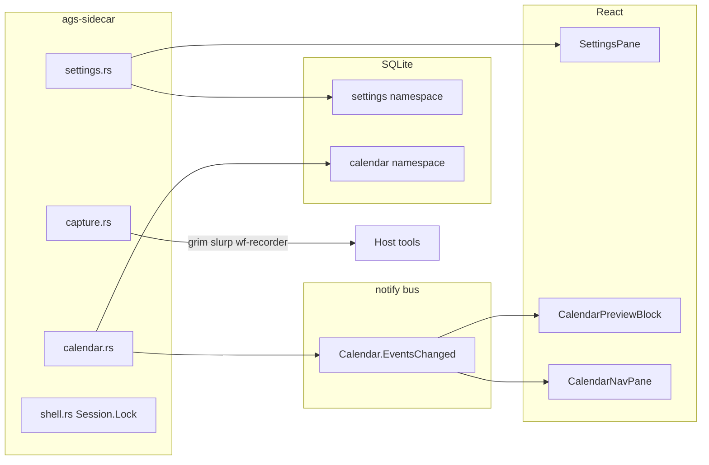

# Shell platform (P0 contracts, Settings, Capture, Calendar push)

**Status:** Implemented (2026-05-30)  
**Depends on:** [compositor_bar_live.md](compositor_bar_live.md), [control_center_depth.md](control_center_depth.md), contract scripts (`check-api-rpc-contract.sh`, `rpc-manifest.json`)  
**Aligns with:** [BACKEND_TODO.md](../BACKEND_TODO.md) §1, §3.4–3.5, §2.9 (partial), §2.23 (push), §6.1–6.2, §0.1; [top-dropdown.md](../roadmap/top-dropdown.md) (settings schema prerequisite)

**Repo:** `/home/user/Engineering/Productivity/ags` (canonical)

---

## Goal

Close the **platform gaps** that block a coherent shell experience after control-center depth and compositor bar work:

1. **P0 API contract gate** — every `api.ts` method resolves cleanly; `rpc_contract_test` and pane smoke tests green on CI stub env.
2. **`settings.rs`** — persist Aura layout/theme/panel prefs in SQLite; expose `Settings.Get` / `Set` / `GetSchema` for the control center (replace read-only aggregation-only story).
3. **`capture.rs`** — grim/slurp screenshots and wf-recorder recording with allowlisted command assembly (no surprise exec in tests).
4. **`Calendar.EventsChanged`** — WebSocket invalidation for calendar bar tile + control center.
5. **Session lock** — `Session.Lock` → `hyprlock` per ADR (small, safe follow-up).

This slice is **shell infrastructure**, not launcher/Vicinae, VPN state machine, or dashboard aggregation.

---

## Non-goals

| Item | Reason / defer to |
|------|-------------------|
| `launcher.rs` / Vicinae (`§3.3`) | [launcher_vicinae.md](launcher_vicinae.md) |
| `dashboard.rs` / `Dashboard.GetQuickStatus` (`§3.13`) | [dashboard_aggregation.md](dashboard_aggregation.md) |
| VPN connect/disconnect state machine (`§2.7`) | Privileged, large — dedicated plan |
| `todos.rs` (`§3.6`) | CalDAV/NL parsing scope — after Settings |
| `vault.rs` (`§3.7`) | P3 greenfield |
| `Communication` hub depth (`§2.22`) | ADR: separate app; keep stub counts only |
| Multi-monitor `Brightness.*` rewrite (`§2.5`) | Sidebar OSD plan |
| Hyprland rules / multitasking UI (`§3.12`) | Extends `hyprland.rs` later |
| Full Google/CalDAV sync (`§2.23`) | [calendar_sync_todos.md](calendar_sync_todos.md) |
| §2.17 offensive security expansion | [offensive_security.md](offensive_security.md) |

---

## Prerequisites

| Prerequisite | Why |
|--------------|-----|
| SQLite KV + `scan_namespace` | Settings namespaces, existing calendar/automation patterns |
| `notify::emit` + `connectWs` in UI | `Calendar.EventsChanged` |
| `sidecar/tests/common/mod.rs` deny-list | Capture/Session mutating RPCs stay off default harness |
| `SettingsPane.tsx` exists (read-only aggregates) | Becomes consumer of real `Settings.*` RPCs |
| Bar `CalendarPreviewBlock` | WS invalidation target |

---

## Architecture

---

## Test file policy

**Do not** add numbered bucket test crates. Name tests by **domain**, matching the existing layout under `sidecar/tests/`:

| Pattern | Examples already in repo |
|---------|--------------------------|
| `*_storage_test.rs` | `calendar_storage_test.rs`, `automation_storage_test.rs`, `productivity_storage_test.rs` |
| `*_rpc_shapes.rs` / `coverage_rpc_shapes.rs` | `hyprland_rpc_shapes.rs`, `media_rpc_shapes.rs`, `coverage_rpc_shapes.rs` |
| `*_dispatch_test.rs` / `*_events_test.rs` | `hyprland_dispatch_test.rs`, `hyprland_events_test.rs` |
| `integration_test.rs` | P0 smoke, readonly gap sets, method name strings for `rpc_contract_test` |
| `server_http_test.rs` | WebSocket push delivery |
| `#[cfg(test)]` in service module | Pure logic (merge, argv builders, debounce) — no registry needed |

Extend existing files where the behavior belongs; add a new integration crate only when it is a distinct domain (e.g. `settings_storage_test.rs`), not a catch-all bucket.

---

## Resolved decisions

| Topic | Decision |
|-------|----------|
| Settings v1 | `bar_section_order`, `cc_enabled_panes`, `theme`, `dropdown_modules`; SQLite key `settings` / `aura_v1` |
| `Settings.Set` | Top-level deep-merge; unknown keys rejected |
| Capture clipboard | `wl-copy --type image/png` only (see `scripts/region-screenshot.sh`) |
| Recording | Video-only `wf-recorder` v1 |
| `Calendar.EventsChanged` | `{ "reason": "create" \| "update" \| "delete" \| "reminder" }` — broad query invalidation, no `event_id` in v1 |
| `Session.Lock` | `hyprlock` if on PATH, else `loginctl lock-session` |
| §1 aliases | **No new RPC aliases** per ADR — update docs; clients already use `Packages.GetUpgradable`, `GameMode.IsEnabled`, `Storage.Get` |

---

## Vertical slices

### Slice A — P0 contract gate — **P0**

**Problem:** [§1](../BACKEND_TODO.md) table and `rpc_contract_test` still have gaps; some panes call aggregates that drift from manifest or return opaque errors.

| Task | Details |
|------|---------|
| A.1 Audit | Run `./scripts/check-api-rpc-contract.sh`; grep `api.ts` vs `rpc-manifest.json`; fix any missing registrations (e.g. ensure `Automation.ListRules` / `Automation.Trigger` are registered **and** in manifest). |
| A.2 Aggregates | Verify/fix shapes for `Security.GetStatus`, `Performance.GetMetrics`, `DevOps.GetStatus`, `Productivity.GetStats` — match `api-types.ts` adapters (add fields or narrow clients). |
| A.3 Docs | Mark stale §1 rows done in BACKEND_TODO (aggregates exist; no alias RPCs). |
| A.4 Tests | **Extend** [`integration_test.rs`](../sidecar/tests/integration_test.rs): `API_TS_READONLY_METHODS` + `api_ts_readonly_methods_resolve` (live `call_method` per read-safe `api.ts` RPC). **Extend** [`coverage_rpc_shapes.rs`](../sidecar/tests/coverage_rpc_shapes.rs) for aggregate fields used by adapters. Add `Automation.ListRules` to method strings in `integration_test.rs` so [`rpc_contract_test.rs`](../sidecar/tests/rpc_contract_test.rs) sees coverage. |
| A.5 CI | `./scripts/sidecar-test-fast.sh` must pass including `rpc_contract_test`. |

**Files:** `sidecar/src/services/*.rs` (minimal fixes), `ui/src/lib/api.ts`, `ui/src/lib/api-types.ts`, `sidecar/tests/integration_test.rs`, `sidecar/tests/coverage_rpc_shapes.rs`, `sidecar/tests/rpc_contract_test.rs`, `sidecar/rpc-manifest.json` (regenerated)

**Acceptance:** Contract script OK; fast test suite green; no pane 500s from missing RPC names on stub env.

---

### Slice B — Settings service (`settings.rs`) — **P1**

**Problem:** `SettingsPane` only aggregates Power/Network/Bluetooth/etc.; Aura-specific prefs (bar layout, theme tokens, enabled CC modules) have no persistence API ([§3.5](../BACKEND_TODO.md)).

| Task | Details |
|------|---------|
| B.1 Schema | Define `AuraSettings` JSON schema v1: `bar_section_order`, `cc_enabled_panes`, `theme` (`dark`/`light`/catppuccin variant), `dropdown_modules` (ids only, no DnD yet). Store under SQLite namespace `settings`. |
| B.2 RPCs | `Settings.Get`, `Settings.Set` (partial merge), `Settings.GetSchema`, `Settings.Reset` (namespace or key). |
| B.3 Validation | Reject unknown keys at top level; size cap; no arbitrary shell in values. |
| B.4 UI | `SettingsPane.tsx`: load/save Aura section; keep existing live snapshots as secondary cards. |
| B.5 TS | `api.ts` + `api-types.ts` + parsers. |
| B.6 Tests | Merge/validation: `#[cfg(test)]` in `settings.rs`. Integration: **new** [`settings_storage_test.rs`](../sidecar/tests/settings_storage_test.rs) (`setup_temp_storage_db`, Get/Set/Reset round-trip, reject unknown keys). Readonly: add `Settings.Get` / `Settings.GetSchema` to `integration_test.rs` readonly set. |

**RPC (new):**

- `Settings.Get` → `{ settings: AuraSettings, schema_version: number }`
- `Settings.Set` → `{ settings: AuraSettings }` params partial
- `Settings.GetSchema` → JSON Schema or documented field list
- `Settings.Reset` → `{ ok: true }`

**Files:** `sidecar/src/services/settings.rs` (new), `sidecar/src/lib.rs`, `ui/src/pages/control-center/panes/SettingsPane.tsx`, `ui/src/lib/api.ts`, `sidecar/tests/settings_storage_test.rs`

**Acceptance:** Change bar section order in Settings → restart sidecar → bar reads persisted order (or document reload hook). Schema documented in `sidecar/README.md`.

---

### Slice C — Capture service (`capture.rs`) — **P1**

**Problem:** No screenshot/recording RPCs; roadmap capture revamp blocked ([§3.4](../BACKEND_TODO.md)).

| Task | Details |
|------|---------|
| C.1 Screenshot | `Capture.Screenshot` params: `mode` (`region` \| `window` \| `full`), `output` (`clipboard` \| `file`), optional `path`. Assemble `grim` + `slurp` (region) or `grim -o` (full); `wl-copy` for clipboard. |
| C.2 Recording | `Capture.RecordStart` / `Capture.RecordStop` — `wf-recorder` pid file in `~/.local/share/ags-sidecar/`; timeout guard. |
| C.3 List devices | `Capture.ListDevices` — read-only `pactl`/`v4l2` or static empty when tools missing. |
| C.4 Allowlist | Reuse pattern from `Hyprland.Dispatch` / automation: no user-supplied shell; fixed argv tables. |
| C.5 UI | Minimal: keybind doc + optional Control Center card or `ags msg` handler doc (no heavy editor). |
| C.6 Tests | Argv builders + path validation: `#[cfg(test)]` in `capture.rs` (same style as `hyprland::validate_dispatch` tests). Readonly `Capture.ListDevices`: add to `integration_test.rs` readonly set. Mutating RPCs stay deny-listed; optional `#[ignore]` host screenshot test in `capture.rs` module tests only. |

**RPC (new):**

- `Capture.Screenshot`, `Capture.RecordStart`, `Capture.RecordStop`, `Capture.ListDevices`

**Files:** `sidecar/src/services/capture.rs` (new), `sidecar/tests/common/mod.rs` (deny-list), optional `sidecar/tests/fixtures/capture/` only if argv tests need fixtures

**Acceptance:** On Hyprland host with grim/slurp installed, region screenshot lands in clipboard or `~/Pictures`; sidecar does not panic when tools absent.

---

### Slice D — Calendar WebSocket push — **P1**

**Problem:** Calendar reminder tick writes notifications but bar/calendar panes may still poll until WS invalidation lands (see [compositor_bar_live.md](compositor_bar_live.md) open questions).

| Task | Details |
|------|---------|
| D.1 Emit | On `CreateEvent`, `DeleteEvent`, reminder fire: `notify::emit("Calendar.EventsChanged", { "reason": "create" \| "delete" \| "reminder" })`. |
| D.2 Debounce | 100–250ms coalesce bursts (same pattern as `Hyprland.StateChanged`). |
| D.3 UI | `CalendarNavPane.tsx`, `BarStrip.tsx` `CalendarPreviewBlock`: `connectWs` + invalidate `["cal"]` / calendar queries. |
| D.4 Tests | Debounce: `#[cfg(test)]` in `calendar.rs`. CRUD + emit side effects: **extend** [`calendar_storage_test.rs`](../sidecar/tests/calendar_storage_test.rs). WS delivery: **extend** [`server_http_test.rs`](../sidecar/tests/server_http_test.rs) (`Calendar.EventsChanged` over `/ws`, same pattern as existing notify push test). |

**Files:** `sidecar/src/services/calendar.rs`, `ui/src/pages/BarStrip.tsx`, `ui/src/pages/control-center/panes/CalendarNavPane.tsx`, `sidecar/tests/calendar_storage_test.rs`, `sidecar/tests/server_http_test.rs`

**Acceptance:** Create event in CC → bar preview updates without 60s wait.

---

### Slice E — Session lock (`hyprlock`) — **P2** (small)

**Problem:** ADR specifies `hyprlock`; `Session.Lock` may still use `loginctl` ([§2.9](../BACKEND_TODO.md)).

| Task | Details |
|------|---------|
| E.1 | `Session.Lock` → `hyprlock` when binary present, else `loginctl lock-session`. |
| E.2 | Document in `sidecar/README.md`; no UI change required if Power flyout already calls RPC. |
| E.3 | Test: `resolve_lock_command(use_hyprlock: bool)` (or similar) in `#[cfg(test)]` inside `shell.rs`; integration deny-list unchanged. |

**Files:** `sidecar/src/services/shell.rs` only

**Acceptance:** `Session.Lock` invokes `hyprlock` on dev machine.

---

## Test strategy

| Layer | Where |
|-------|--------|
| **Unit** | `#[cfg(test)]` in `settings.rs`, `capture.rs`, `calendar.rs`, `shell.rs` |
| **Integration (storage)** | **New** `settings_storage_test.rs`; **extend** `calendar_storage_test.rs` |
| **Integration (RPC smoke)** | **Extend** `integration_test.rs`, `coverage_rpc_shapes.rs` |
| **Integration (WS)** | **Extend** `server_http_test.rs` |
| **Contract (static)** | **Extend** `rpc_contract_test.rs` regex for `Settings.*` / `Capture.*` |
| **Safety** | **Edit** `common/mod.rs` deny-list for `Capture.Screenshot`, `Capture.RecordStart`, `Capture.RecordStop`; `Session.Lock` stays denied |

**New file (one):** `sidecar/tests/settings_storage_test.rs`. Everything else is edits to existing crates.

---

## Housekeeping (end of slice)

- [ ] `scripts/generate-rpc-manifest.sh` + `check-api-rpc-contract.sh`
- [ ] Update [BACKEND_TODO.md](../BACKEND_TODO.md) §1, §3.4, §3.5, §2.9, §2.23, §9 progress log
- [ ] [sidecar_coverage_baseline.md](../sidecar_coverage_baseline.md) — target `settings.rs` / `capture.rs` >60% lines
- [ ] `sidecar/README.md` — Settings env, Capture tools, Session.Lock behavior
- [ ] `cd sidecar && cargo test`; `./scripts/sidecar-test-fast.sh`; `cd ui && bun run tsc --noEmit`

---

## Suggested implementation order

| ID | Slice | Description |
|----|-------|-------------|
| `contract-gate` | A | P0 contract + `rpc_contract_test` green |
| `settings-svc` | B | `settings.rs` + SettingsPane persistence |
| `capture-svc` | C | `capture.rs` + argv tests |
| `calendar-ws` | D | `Calendar.EventsChanged` + UI invalidation |
| `session-lock` | E | `hyprlock` for `Session.Lock` |
| `housekeeping` | — | docs, manifest, coverage |

Work **A first** (unblocks CI), then **B** (unblocks future dropdown), **D** (quick win), **C**, **E**.

---

## Estimated scope & risk

| Dimension | Estimate |
|-----------|----------|
| **Engineering time** | ~4–6 focused days (5 slices + tests) |
| **Risk: Capture host deps** | grim/slurp/wf-recorder optional; clear errors |
| **Risk: Settings schema churn** | Version field + defaults for forward compat |
| **Risk: wf-recorder zombie** | PID file + stop timeout + kill on drop |
| **Coverage delta** | +3–5% total; new modules >60% with argv/settings tests |

---

## Test plan (summary)

| Area | Automated | Manual |
|------|-----------|--------|
| Contract | All `api.ts` methods smoke | Open each CC pane on stub env |
| Settings | SQLite round-trip | Reorder bar sections, reload |
| Capture | argv unit tests | Region screenshot to clipboard |
| Calendar WS | debounce unit + temp DB | Bar tile updates on add |
| Session | argv branch test | Lock screen via hyprlock |

---

## BACKEND_TODO sections addressed

| Section | Items |
|---------|--------|
| **§1** | API contract table completion |
| **§3.5** | Settings service |
| **§3.4** | Capture service |
| **§2.23** | Calendar push (partial; no CalDAV) |
| **§2.9** | Session.Lock → hyprlock |
| **§6.1–6.2** | Smoke + Settings/Capture pane rows |
| **§0.7** | `settings_storage_test.rs`; extend calendar/integration/server_http tests |
| **§5** | `api.ts`, `api-types.ts`, SettingsPane, bar calendar |

**Deferred:** §3.3 Launcher, §3.13 Dashboard, §2.7 VPN, §3.6 Todos, §3.7 Vault

---

## Risks

| Risk | Mitigation |
|------|------------|
| Contract fixes sprawl | Slice A time-boxed; no refactors outside §1 rows |
| wf-recorder orphans | PID file + Stop kills process group |
| Settings corrupt JSON | Schema version + reset RPC |
| Capture in CI | No real Wayland; argv tests only |

---

*Created 2026-05-29. Set status to **Implemented** and link PRs in BACKEND_TODO §9 when slices land.*
