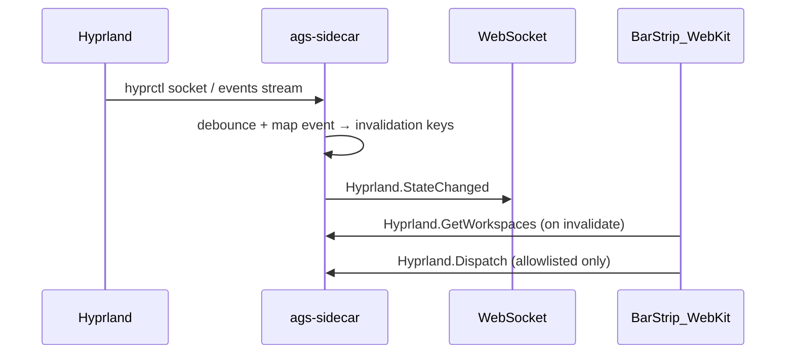

# Wave 5 — Compositor bar live sync (Hyprland depth + media transport)

**Status:** Implemented (2026-05-29)  
**Depends on:** Wave 4 (notify bus, SQLite CRUD patterns, contract scripts), Wave 3 (React bar on `Hyprland.*` / `Media.GetNowPlaying`), P0 test harness (`call_method` deny-list, `AURA_STORAGE_DB`)  
**Aligns with:** [BACKEND_TODO.md](../BACKEND_TODO.md) §2.8, §2.10 (partial), §6.1 P0 smoke; [react-bar-migration.md](../roadmap/react-bar-migration.md); deferred Wave 3 preview item “Hyprland shell — event stream over WS”

**Repo:** `/home/user/Engineering/Productivity/ags` (canonical; `~/.config/ags` symlink or copy may differ — see [Binary path](#binary-path-caveat) below)

---

## Goal

Make the **React/WebKit bar** feel as live as the GTK bar did, without unsafe `hyprctl dispatch` or 1.5s polling:

1. **Typed, tested Hyprland RPCs** — stable DTOs shared by sidecar, `api-types.ts`, and bar parsers (replace `unknown` + ad-hoc `parseWorkspaces` as source of truth).
2. **`Hyprland.Dispatch` allowlist** — only bar-approved workspace/window/focus commands; reject injection and arbitrary shell.
3. **WebSocket invalidation** — compositor changes push `Hyprland.*Changed` events so `BarStrip` / `WindowsFlyout` drop `refetchInterval` polling.
4. **Bar media transport** — expose existing `Audio.Media.*` in `api.ts`, harden `Media.GetNowPlaying` (`playing` from `playerctl status`), optional mini controls on the bar.

This is the **shell/compositor** wave after Wave 4’s **Control Center depth** — not launcher, capture, settings, VPN, or communication hub.

---

## Non-goals (Wave 5)

| Item | Reason / defer to |
|------|-------------------|
| `launcher.rs` / Vicinae (`§3.3`) | Own wave; needs product contract |
| `capture.rs` screenshots/recording (`§3.4`) | Own wave; grim/slurp/wf-recorder host deps |
| `settings.rs` Aura JSON schema (`§3.5`) | Own wave; forms + schema design |
| `Dashboard.GetQuickStatus` / dropdown module system (`§3.13`) | Needs settings schema + perf budget ([top-dropdown.md](../roadmap/top-dropdown.md)) |
| VPN state machine (`§2.7`) | Large, privileged |
| `Communication.GetUnread` (`§2.22`) | ADR: separate app |
| Full `System.GetStats` / GPU sensors (`§2.6`) | Performance pane exists; deep sensors = later wave |
| Multi-monitor `Brightness.*` rewrite (`§2.5`) | Sidebar OSD wave; bar only consumes if trivial |
| `Session.*` polkit / `hyprlock` swap (`§2.9`) | Small follow-up PR acceptable; not headline |
| Hyprland **rules** editor, workspace thumbnails, multitasking UI | Roadmap sidebar; backend events only |
| §1 remaining contract rows unrelated to Hyprland/media | Track in contract-fix PR or Wave 6 |

---

## Prerequisites (Wave 4)

| Prerequisite | Why |
|--------------|-----|
| `notify::emit` + WS clients in UI (`connectWs`, `useWsStore`) | Same invalidation pattern as `Performance.MetricsChanged`, `Productivity.TimerTick` |
| `scripts/check-api-rpc-contract.sh` + `rpc-manifest.json` CI | New methods must not drift from `api.ts` |
| `sidecar/tests/common/mod.rs` deny-list | `Hyprland.Dispatch` stays integration-safe via allowlist unit tests + unchecked only under `#[ignore]` |
| React bar shipped (`BarStrip.tsx`, `WindowsFlyout.tsx`) | Consumers for typed RPCs + WS |
| Wave 4 calendar reminders | Optional: bar `CalendarPreviewBlock` can later subscribe to `Calendar.*Changed` — **not** in Wave 5 scope |

---

## Architecture (Hyprland events)

- **Transport:** `{ method, params }` on existing `/ws` (see `notify.rs`).
- **Debounce:** 50–150ms bursts (workspace flips, layout loads).
- **CI without Hyprland:** event loop not started; RPCs return typed empty/error; parser tests use fixtures only.

---

## Vertical slices

### Slice A — Typed Hyprland models & parser tests — **P1**

**Problem:** `hyprland.rs` returns raw `serde_json::Value`; bar re-parses defensively; no `tests/fixtures/hyprland/`; `hyprland.rs` ~53% line coverage with no shape integration tests.

| Task | Details |
|------|---------|
| A.1 Rust DTOs | Add to `sidecar/src/types.rs` (or `services/hyprland/types.rs`): `HyprWorkspace`, `HyprClient`, `HyprMonitor`, `HyprActiveWindow`, `HyprActiveWorkspace` — fields bar uses today (`id`, `name`, `windows`, `address`, `class`, `title`, `workspace`, `floating`, monitor `name`/`activeWorkspace`). |
| A.2 Map hyprctl JSON | `hyprland.rs`: `parse_workspaces`, `parse_clients`, etc. with `#[cfg(test)]` + fixtures; RPC handlers return `Vec<HyprWorkspace>` not opaque `Value`. |
| A.3 Fixtures | `sidecar/tests/fixtures/hyprland/workspaces.json`, `clients.json`, `monitors.json`, `activewindow.json`, `activeworkspace.json` (minimal real-shaped samples). |
| A.4 TS types | `ui/src/lib/api-types.ts`: mirror DTOs; change `api.ts` return types from `unknown` to typed arrays/objects. |
| A.5 UI | `BarStrip.tsx`, `WindowsFlyout.tsx`: delete duplicate parsers where types suffice; keep thin guards for dev-server/no-Hyprland. |
| A.6 Tests | `sidecar/tests/wave5_hyprland_shapes.rs`: registry calls assert array lengths, field types, stable sort; add methods to `WAVE5_READONLY_METHODS` bulk set. |

**RPC (unchanged names, stricter output):**

- `Hyprland.GetWorkspaces` → `HyprWorkspace[]`
- `Hyprland.GetActiveWorkspace` → `HyprActiveWorkspace | null`
- `Hyprland.GetClients` → `HyprClient[]`
- `Hyprland.GetActiveWindow` → `HyprActiveWindow | null`
- `Hyprland.GetMonitors` → `HyprMonitor[]`

**Files:** `sidecar/src/services/hyprland.rs`, `sidecar/src/types.rs`, `ui/src/lib/api.ts`, `ui/src/lib/api-types.ts`, `ui/src/pages/BarStrip.tsx`, `ui/src/components/bar/flyouts/WindowsFlyout.tsx`, `sidecar/tests/fixtures/hyprland/*`, `sidecar/tests/wave5_hyprland_shapes.rs`

**Acceptance:** With Hyprland running, shape tests pass on host; without Hyprland, RPCs return `[]` / `null` and **do not panic**. Fixture unit tests cover all parsers without `hyprctl`.

---

### Slice B — `Hyprland.Dispatch` allowlist — **P1**

**Problem:** `Hyprland.Dispatch` accepts any string → command injection risk (`;`, subshells, arbitrary dispatchers).

| Task | Details |
|------|---------|
| B.1 Allowlist module | `validate_dispatch(command: &str) -> Result<DispatchAction>` — parse first token + bounded args (max arity, max string len). |
| B.2 Allowed verbs (v1) | Match current bar UI only: `workspace` (id/name), `movetoworkspace`, `focuswindow` (`address:` hex only), `togglefloating`, `togglespecialfloating`, `pin`, `unpin`, `killactive`, `movefocus` (l/r/u/d), `swapwindow` (l/r/u/d). **Explicitly reject** `exec`, `execr`, `keyword`, raw `hyprctl` passthrough, `;`, `|`, `` ` ``. |
| B.3 Error surface | Structured JSON error: `{ "code": "dispatch_denied", "message": "..." }` (align with §0.5 registry goal when touched). |
| B.4 Bar audit | Grep `hyprlandDispatch(` in `ui/` — every call site must match allowlist; add TS helper `hyprlandDispatchSafe(action, params)` if needed. |
| B.5 Tests | Unit: allowed + denied tables; integration: `call_method` with denied command must error **without** calling `hyprctl` (mock not required if validator runs first). Denied cases never use unchecked harness. |

**RPC:**

- `Hyprland.Dispatch` `{ "command": "workspace 3" }` — unchanged params; behavior change only.

**Files:** `sidecar/src/services/hyprland.rs` (or `hyprland/dispatch.rs`), `sidecar/tests/common/mod.rs` (comment: Dispatch still denied in default `call_method`), `ui/src/lib/api.ts`, bar call sites.

**Acceptance:** `Hyprland.Dispatch` with `exec kitty` fails fast; `workspace 2` succeeds on Hyprland host. Deny-list integration tests remain green.

---

### Slice C — Hyprland WebSocket push — **P1**

**Problem:** `BarStrip` / `WindowsFlyout` poll every **1500ms**; wastes work and feels laggy vs GTK event-driven bar.

| Task | Details |
|------|---------|
| C.1 Event source | Prefer Hyprland **socket** (`hyprctl -j/events` or documented `/.socket2.sock` JSON lines). Spawn background task in `main.rs` or `hyprland::start_event_listener()` when `HYPRLAND_INSTANCE_SIGNATURE` present. |
| C.2 Event mapping | Map `workspace`, `focusedmon`, `activewindow`, `openwindow`, `closewindow`, `movewindow`, etc. → single debounced notify: `Hyprland.StateChanged` with `{ "areas": ["workspaces","clients","active"] }` (v1 simplicity). |
| C.3 Optional granular | If cheap, also emit `Hyprland.ActiveWindowChanged` for flyouts — **decide in review** (see Open questions). |
| C.4 Fallback | If socket unavailable: no listener; bar keeps polling (document env `AURA_HYPRLAND_EVENTS=0`). |
| C.5 UI | `BarStrip.tsx`, `WindowsFlyout.tsx`: `connectWs()` + `useWsStore.on("Hyprland.StateChanged", invalidateQueries)`; remove or lengthen `refetchInterval` to 60s safety net only. |
| C.6 Tests | Unit: feed fixture event lines → debouncer fires once; `server_http_test`-style WS assert one message (no real Hyprland). |

**RPC / events (new):**

- **Push:** `Hyprland.StateChanged` (no new read RPC required)

**Files:** `sidecar/src/services/hyprland.rs`, `sidecar/src/main.rs`, `sidecar/src/notify.rs` (export only), `ui/src/pages/BarStrip.tsx`, `ui/src/components/bar/flyouts/WindowsFlyout.tsx`, `sidecar/tests/wave5_hyprland_events_test.rs`

**Acceptance:** On Hyprland, switching workspace updates bar indicators within one debounced WS tick **without** waiting 1.5s. CI passes without compositor (listener disabled).

---

### Slice D — Bar media transport + MPRIS hardening — **P1**

**Problem:** `Media.GetNowPlaying` infers `playing` from non-empty title; `Audio.Media.PlayPause|Next|Previous` exist in sidecar but are **not** in `api.ts`; bar shows icon only, no controls; duplicate `Media.*` vs `Audio.Media.*` in manifest.

| Task | Details |
|------|---------|
| D.1 `Media.GetNowPlaying` | Use `playerctl status` (or `playerctl -a metadata` + status) for real `playing` / `paused` / `stopped`; keep title/artist from metadata; optional `player_name` field. |
| D.2 Fixtures | `sidecar/tests/fixtures/audio/playerctl_status.txt`, extend metadata tab tests in `mpris.rs`. |
| D.3 `api.ts` | Add `mediaGetPlayers`, `mediaPlayPause`, `mediaNext`, `mediaPrevious` → `Audio.Media.*`; document `Media.GetNowPlaying` as bar convenience (no deprecation in v1). |
| D.4 UI | `BarStrip.tsx` `MediaBlock`: click icon → play/pause; optional long-press or secondary strip for next/prev; `connectWs` optional `Media.NowPlayingChanged` if lightweight poll in sidecar (30s) — prefer playerctl loop only if cheap. |
| D.5 Tests | Unit parse status; integration shape `Audio.Media.GetPlayers`; deny-list keeps `Audio.Media.PlayPause` etc. off default `call_method`. |

**RPC:**

- `Media.GetNowPlaying` — enhanced response
- `Audio.Media.GetPlayers`, `Audio.Media.PlayPause`, `Audio.Media.Next`, `Audio.Media.Previous` — wire UI only (implementations exist)

**Files:** `sidecar/src/services/mpris.rs`, `sidecar/src/services/audio.rs` (if consolidating), `ui/src/lib/api.ts`, `ui/src/pages/BarStrip.tsx`, `sidecar/tests/fixtures/audio/*`, `sidecar/tests/wave5_media_shapes.rs`

**Acceptance:** Spotify/mpv playing: bar shows note icon **and** play/pause works; paused player hides icon or shows paused state per UX choice. CI: fixture tests only.

---

## Test strategy

| Layer | Approach |
|-------|----------|
| **Unit** | Hyprland JSON fixtures → typed structs; dispatch allowlist matrix; playerctl status parser; event-line debouncer |
| **Integration** | `ServiceRegistry` + `call_method` for all `Hyprland.Get*` shape tests; `Media.GetNowPlaying` / `Audio.Media.GetPlayers` shapes; **never** `Hyprland.Dispatch` in default harness |
| **Temp DB** | Not required for this wave (no new SQLite namespaces) |
| **HTTP/WS** | Extend `server_http_test.rs` or `wave5_hyprland_events_test.rs`: connect `/ws`, inject `notify::emit("Hyprland.StateChanged", …)`, assert delivery |
| **Safety** | Keep `Hyprland.Dispatch`, `Audio.Media.PlayPause|Next|Previous` on `tests/common/mod.rs` deny-list; allowlist tests call validator directly or `call_method_unchecked` under `#[ignore]` with comment |
| **Manual** | Hyprland: switch workspace, focus window from flyout, play/pause media; confirm bar updates &lt;200ms after WS |

**New test files (proposed):**

- `sidecar/tests/wave5_hyprland_shapes.rs`
- `sidecar/tests/wave5_hyprland_dispatch_test.rs`
- `sidecar/tests/wave5_hyprland_events_test.rs`
- `sidecar/tests/wave5_media_shapes.rs`

Register readonly methods in `integration_test.rs` (`WAVE5_READONLY_METHODS`) and run `./scripts/sidecar-test-fast.sh` in CI.

---

## Housekeeping (end of wave)

- [ ] `scripts/generate-rpc-manifest.sh` if any RPC signature changes (unlikely except error shape)
- [ ] `scripts/check-api-rpc-contract.sh` — typed `api.ts` exports
- [ ] Update [BACKEND_TODO.md](../BACKEND_TODO.md) §2.8, §2.10, §6.1 (`Hyprland.GetWorkspaces` smoke), §9 progress log
- [ ] [sidecar_coverage_baseline.md](../sidecar_coverage_baseline.md) — re-run `./scripts/sidecar-coverage.sh --summary-only`; target `hyprland.rs` &gt;70%, `mpris.rs` maintained
- [ ] `sidecar/README.md`: Hyprland event env vars, dispatch allowlist table, `playerctl` optional
- [ ] [react-bar-migration.md](../roadmap/react-bar-migration.md): note WS-driven bar + allowlist
- [ ] `cd sidecar && cargo test`; `./scripts/sidecar-test-fast.sh`; `cd ui && bun run tsc --noEmit`
- [ ] **Binary path caveat:** document in README + [BACKEND_TODO.md](../BACKEND_TODO.md) §0.1 — `src/lib/sidecar.ts` may point at `~/.config/ags/sidecar/target/...`; dev clones under `Engineering/Productivity/ags` should set `AURA_SIDECAR` or build into expected path

---

## Suggested implementation order

| ID | Slice | Description |
|----|-------|-------------|
| `w5-hypr-types` | A | DTOs + fixtures + shape tests + TS types |
| `w5-hypr-dispatch` | B | Allowlist + structured errors + bar audit |
| `w5-hypr-events` | C | Socket listener + `Hyprland.StateChanged` + bar WS |
| `w5-media-bar` | D | MPRIS status + api.ts + MediaBlock controls |
| `w5-housekeeping` | — | manifest, BACKEND_TODO, coverage baseline, README |

Work **one ID per PR** when possible; Slice B before widening `Dispatch` usage in UI.

---

## Estimated scope & risk

| Dimension | Estimate |
|-----------|----------|
| **Engineering time** | ~3–5 focused days (4 slices + tests) |
| **Risk: Hyprland socket API drift** | Pin to documented event names; feature-flag listener |
| **Risk: WebKit WS in bar** | Reuse proven `connectWs` from Control Center / flyouts |
| **Risk: Dispatch allowlist too tight** | Start with grep of `ui/` call sites; expand via explicit ADR addendum |
| **Risk: playerctl missing** | Same as today — empty media block, no panic |
| **Coverage delta** | +5–10% on `hyprland.rs`; modest on `mpris.rs` |

---

## Test plan (summary)

| Area | Automated | Manual |
|------|-----------|--------|
| Typed Hyprland | Fixture parsers + shape integration | Bar workspaces match `hyprctl workspaces` |
| Dispatch allowlist | Deny matrix unit tests | Focus window from flyout |
| WS events | Mock emit over `/ws` | Workspace switch &lt;200ms UI |
| Media | playerctl fixtures | Play/pause from bar |

---

## BACKEND_TODO sections addressed

| Section | Items |
|---------|--------|
| **§2.8** Hyprland | Typed JSON, `Dispatch` allowlist, `GetMonitors`, event → WS, unit fixtures, integration tests |
| **§2.10** MPRIS / media | `GetNowPlaying` accuracy, transport (via `Audio.Media.*` + UI), fixture tests |
| **§6.1** P0 smoke | `Hyprland.GetWorkspaces` (and related) shape coverage |
| **§0.7** Test infrastructure | New fixtures dir `hyprland/`, wave5 integration modules |
| **§5** Client sync | `api.ts`, `api-types.ts`, bar components (partial `sidecar.ts` GTK later) |
| **§0.1** (housekeeping) | Binary path documentation touch-up |

**Not addressed this wave:** §3.3–3.5 (new services), §2.5–2.7, §2.9 shell/polkit, §3.13 dashboard, §2.21 automation fixes, §1 contract table (unless discovered blocking bar).

---

## Open questions (review before implementation)

1. **Event granularity:** Single `Hyprland.StateChanged` vs separate `Workspace` / `ActiveWindow` / `Clients` events for finer React Query keys?
2. **Kill / close in allowlist:** Should `killactive` be allowed from bar UI, or only focus/switch workspace in v1?
3. **`Session.Lock`:** Switch from `loginctl lock-session` to `hyprlock` per ADR — include in Wave 5 housekeeping or defer?
4. **`Media.*` vs `Audio.Media.*`:** Keep both with docs, or deprecate `Media.GetNowPlaying` in manifest for single namespace?
5. **Repo canonical path:** Confirm `Engineering/Productivity/ags` vs `~/.config/ags` for CI and `AURA_SIDECAR` defaults on Chris’s machine.
6. **Calendar bar tile:** Subscribe to a future `Calendar.EventsChanged` in Wave 6, or add read poll invalidation when Wave 4 reminder fires?

---

## Risks

| Risk | Mitigation |
|------|------------|
| Hyprland absent in CI | Feature-detect; fixture-only tests |
| Event listener CPU | Debounce; coalesce to one notify per frame burst |
| Allowlist blocks legitimate user binds | Document extension process; don’t parse from user config automatically |
| `playerctl` multi-player | `player_name` param + prefer `playerctld` if installed (optional) |
| Running sidecar binary from wrong path | `AURA_SIDECAR` + README; optional `scripts/which-sidecar.sh` |

---

*Created 2026-05-28. Set status to **Implemented** and link PRs in BACKEND_TODO §9 when slices land.*
